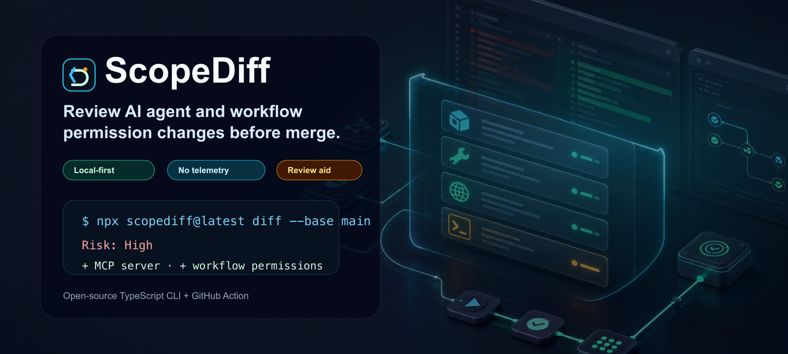
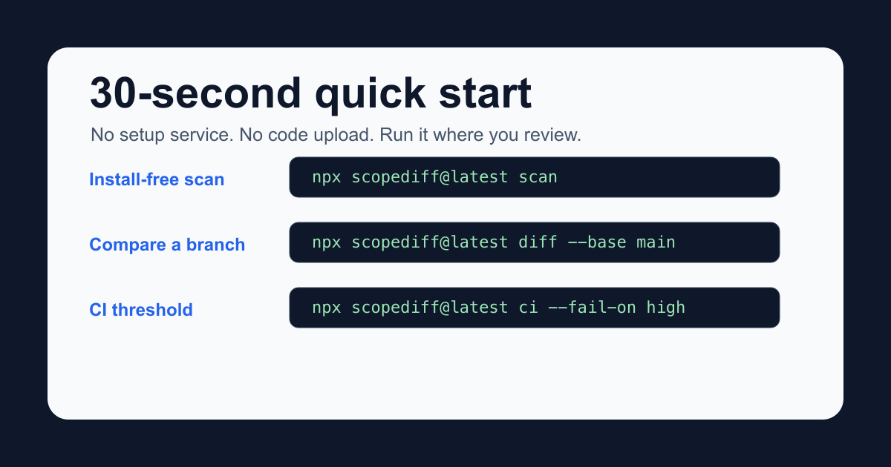
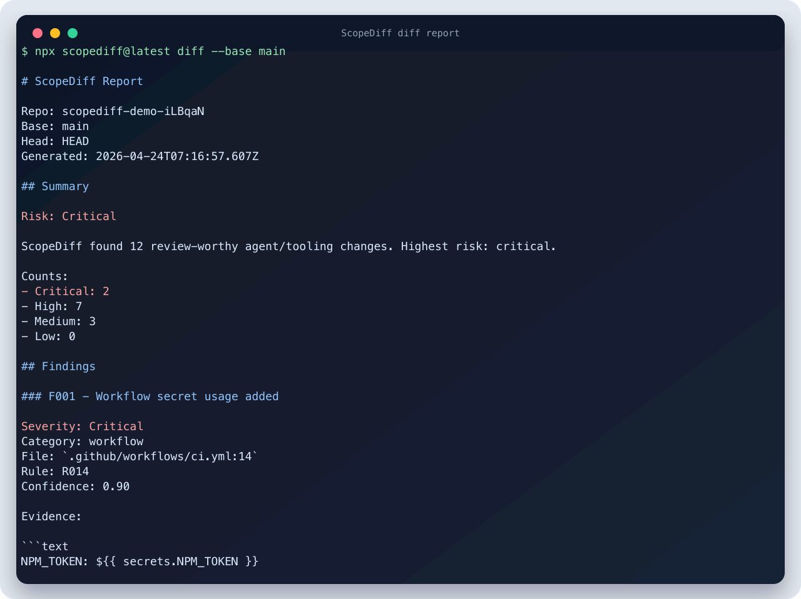
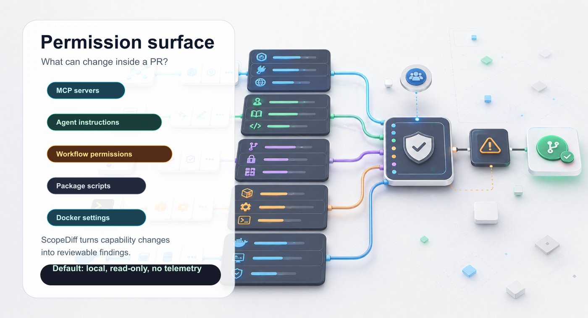
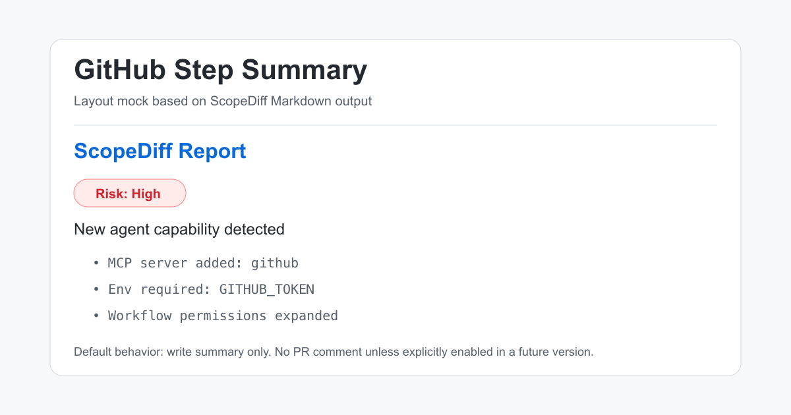

# ScopeDiff

[](https://www.npmjs.com/package/scopediff)
[](https://github.com/xiwuqi/scopediff/actions/workflows/ci.yml)
[](LICENSE)

AI agent permission and tooling surface diffs for pull request review.

> This PR gives your AI agent new powers. Review them before merge.

[Translations](#translations): [简体中文](docs/i18n/README.zh-CN.md) · [日本語](docs/i18n/README.ja-JP.md) · [Español](docs/i18n/README.es.md) · [Français](docs/i18n/README.fr.md) · [Português (Brasil)](docs/i18n/README.pt-BR.md) · [Deutsch](docs/i18n/README.de.md)

ScopeDiff helps maintainers spot changes to MCP servers, agent instructions, GitHub Actions permissions, package lifecycle scripts, Docker settings, and other files that can change what AI agents or automation are able to do.

It is a review aid, not a complete security audit, vulnerability scanner, or runtime protection system.



## Why ScopeDiff

- See agent/tooling permission changes before merge.
- Run locally or in CI without uploading code.
- Get PR-ready Markdown and JSON reports with evidence and suggested review steps.

## Why This Exists

AI agent setup is starting to live inside repositories: MCP servers, `AGENTS.md`, Cursor rules, Claude skills, GitHub Actions permissions, and package lifecycle scripts. A pull request can now change more than application code; it can also change what tools an agent can run, which tokens it expects, and which automation paths can publish or deploy.

ScopeDiff makes those boundary changes visible for human review.

## Quick Install

```bash
npx scopediff@latest scan
```

Install in a project:

```bash
npm install -D scopediff
```

Run from source:

```bash
npm install
npm run build
node dist/cli.js scan
```

## 30-Second Quick Start



Scan the current repo:

```bash
npx scopediff@latest scan
```

Compare your branch with `main`:

```bash
npx scopediff@latest diff --base main
```

Generate Markdown:

```bash
npx scopediff@latest report --format markdown
```

Run in CI and fail on high-risk findings:

```bash
npx scopediff@latest ci --fail-on high
```

## Example Report



This screenshot is generated from real ScopeDiff CLI output against a temporary demo repository. The full demo report is available in [docs/demo/scopediff-report.md](docs/demo/scopediff-report.md).

The demo PR adds a GitHub MCP server, requests `GITHUB_TOKEN`, uses an unpinned `npx` package, and expands GitHub Actions permissions. ScopeDiff does not decide whether that PR is malicious. It gives reviewers evidence and concrete questions to ask.

```md
## ScopeDiff Report

Risk: High

Findings:

F004 - MCP server added: github
Severity: High
File: .mcp.json:3
Evidence: mcpServers.github.command = npx

F007 - Workflow permission expanded: contents write
Severity: High
File: .github/workflows/ci.yml:5
Previous: read
Current: write

Next review actions:

1. Confirm why the GitHub MCP server is needed.
2. Pin remote packages where practical.
3. Check token scope, workflow triggers, and write permissions.
```

## How To Review Findings

ScopeDiff findings are prompts for human review, not proof of a vulnerability.

- Check the evidence, file, and line range first.
- Compare `previousValue` and `currentValue` when running `diff`.
- Decide whether the capability change is intended and documented.
- Prefer least-privilege tokens, pinned packages, and bounded workflow permissions.
- Treat low-confidence natural-language instruction findings as conservative signals.
- Report noisy results with a small sanitized example; see [Common false positives](docs/common-false-positives.md).

## What ScopeDiff Looks For



- MCP server additions and command/args/env changes.
- Credential-like env names such as `GITHUB_TOKEN` or `API_KEY`.
- Unpinned `npx`, `uvx`, `pipx`, and Docker `latest` usage.
- GitHub Actions permission expansion, sensitive triggers, secrets, and unpinned actions.
- `package.json` lifecycle scripts such as `postinstall` and `prepare`.
- Agent instructions that add read, write, shell, network, publish, deploy, push, or delete behavior.
- Docker privileged mode, host network, root user, or Docker socket access.
- Remote script execution patterns such as `curl | bash`.

## GitHub Actions

Use the released GitHub Action:

```yaml
name: ScopeDiff

on:
  pull_request:

permissions:
  contents: read

jobs:
  scopediff:
    runs-on: ubuntu-latest
    steps:
      - uses: actions/checkout@v4
        with:
          fetch-depth: 0

      - uses: actions/setup-node@v4
        with:
          node-version: 20

      - name: Run ScopeDiff
        uses: xiwuqi/scopediff@v0.1.2
        with:
          base: origin/${{ github.base_ref }}
          fail-on: high
```

By default, ScopeDiff writes to the GitHub Step Summary and does not comment on pull requests.



The image above is a layout mock based on ScopeDiff Markdown output. Capture a real Step Summary from your repository after adding the workflow.

You can also run the npm package directly:

```yaml
- name: Run ScopeDiff
  run: npx scopediff@0.1.2 ci --base origin/${{ github.base_ref }} --fail-on high
```

Pin the action tag or npm version for long-lived CI. Do not use an unpinned branch such as `main`.

## Good Fit

- Repositories using MCP servers.
- Projects with `AGENTS.md`, Cursor rules, Claude skills, or Copilot instructions.
- Open source maintainers reviewing automation changes.
- Teams adding AI coding agents to existing workflows.

## What It Is Not

- Full malware detection.
- Runtime blocking or sandbox enforcement.
- Secret scanning for real `.env` files.
- Vulnerability database checks.
- Automatic PR comments without explicit opt-in.

## Safety and Privacy

ScopeDiff is local-first:

- No telemetry.
- No code upload.
- No default network access.
- No reading `.env` by default.
- No token storage.
- No execution of discovered commands.

## Docs

- [Product spec](docs/product-spec.md)
- [Risk model](docs/risk-model.md)
- [Scanning scope](docs/scanning-scope.md)
- [CLI design](docs/cli-design.md)
- [Report schema](docs/report-schema.md)
- [Scoring](docs/scoring.md)
- [Architecture](docs/architecture.md)
- [MVP acceptance](docs/mvp-acceptance.md)
- [Test plan](docs/test-plan.md)
- [Common false positives](docs/common-false-positives.md)
- [Visual system](docs/brand/visual-system.md)

## Translations

English is the source of truth for behavior, limitations, and release status. Localized README summaries are provided for international discoverability and should stay conservative:

- [简体中文](docs/i18n/README.zh-CN.md)
- [日本語](docs/i18n/README.ja-JP.md)
- [Español](docs/i18n/README.es.md)
- [Français](docs/i18n/README.fr.md)
- [Português (Brasil)](docs/i18n/README.pt-BR.md)
- [Deutsch](docs/i18n/README.de.md)

## Roadmap

- JSONC support for client-specific config files.
- Better line mapping for YAML and JSON findings.
- First-class GitHub Action wrapper.
- Optional, explicitly configured PR comments.
- Rule contribution guide and rule docs pages.

## Contributing

Issues and pull requests are welcome. False-positive reports are especially useful because ScopeDiff should stay conservative and explainable.

See [CONTRIBUTING.md](CONTRIBUTING.md).

## License

MIT

If ScopeDiff helps you review agent/tooling changes more clearly, a star is welcome.
