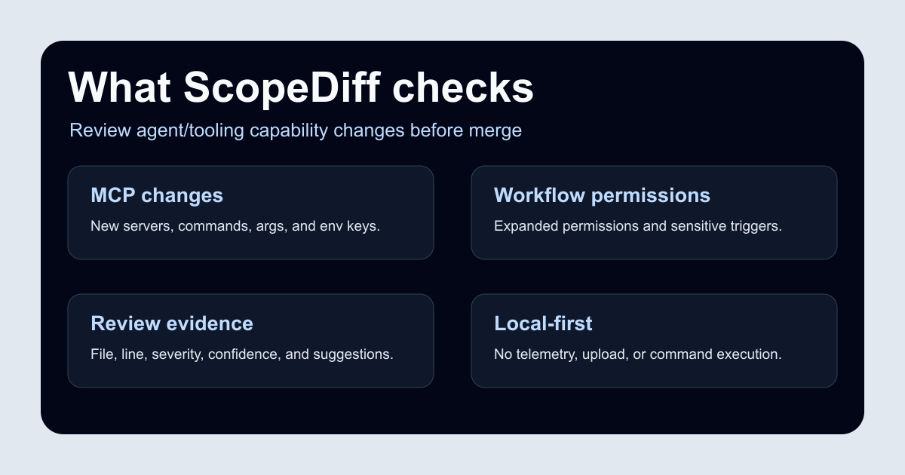

# ScopeDiff

AI agent の権限とツール境界の変更をレビューしやすくする CLI です。

> This PR gives your AI agent new powers. Review them before merge.

[English README](../../README.md) is the source of truth for behavior, limitations, and release status. This page is a Japanese summary for discoverability.



## What It Helps Review

ScopeDiff helps maintainers notice changes such as:

- Added or modified MCP servers.
- Agent instructions, Cursor rules, Claude skills, and Copilot instructions that expand capabilities.
- GitHub Actions permissions, sensitive triggers, secrets, and external actions.
- Package lifecycle scripts, Docker high-privilege settings, and remote script execution patterns.

ScopeDiff is a review aid. It is not a complete security audit, vulnerability scanner, or runtime protection system.

## Quick Start


```bash
npx scopediff@latest scan
```

Compare the current branch with `main`:

```bash
npx scopediff@latest diff --base main
```

Generate a Markdown report:

```bash
npx scopediff@latest report --format markdown
```

Run in CI and fail on high-risk findings:

```bash
npx scopediff@latest ci --fail-on high
```

## Example Report


```md
## ScopeDiff Report

Risk: High

New agent capability detected:

- MCP server added: github
- Command: npx -y @modelcontextprotocol/server-github
- Env required: GITHUB_TOKEN
- Possible scope: repository read/write depending on token permissions

Review notes:

- Pin package version instead of using latest
- Prefer a read-only token for first setup
- Document why this server is needed
- Check whether this PR also changed workflow permissions
```

## Good Fit

- Repositories that use MCP servers.
- Projects with `AGENTS.md`, Cursor rules, Claude skills, or Copilot instructions.
- Open source maintainers reviewing automation and AI tooling changes.
- Teams adopting AI coding agents in existing workflows.

## What It Is Not

- It does not prove a pull request is safe.
- It does not replace security review, secret scanning, or malware analysis.
- It does not execute discovered commands.
- It does not comment on pull requests by default.

## Safety and Privacy

ScopeDiff is local-first: no telemetry, no code upload, no token storage, no default network access, and no execution of discovered commands.

If ScopeDiff helps you review agent/tooling changes more clearly, a star is welcome.
